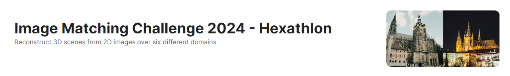
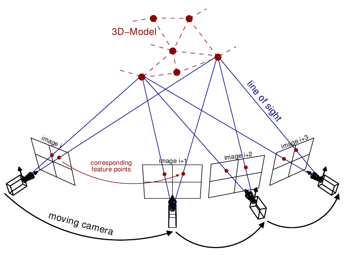

# 48th-Solution using AffNetHardNet in IMC2024



You can check IMC2024 here. [Image Matching Challenge 2024 - Hexathlon](https://www.kaggle.com/competitions/image-matching-challenge-2024)

<br>

# Competetion
The goal of this competition is to construct precise 3D maps using sets of images in diverse scenarios and environments.
The process of reconstructing a 3D model of an environment from a collection of images is called [Structure from Motion](https://en.wikipedia.org/wiki/Structure_from_motion) (**SfM**).

Structure from Motion (SfM) is the name given to the procedure of reconstructing a 3D scene and simultaneously obtaining the camera poses of a camera w.r.t. the given scene. This means that, as the name suggests, we are creating the entire rigid structure from a set of images with different view points (or equivalently a camera in motion).



<br>

# Solution
My solution consists of two parts.
The first is **AffNetHardNet**, and the second is **Reconstruction**.

Image of the structure will be update later...

<br>

# 1. AffNetHardNet
This AffNetHardNet solution was based on the [6th place solution of IMC2023](https://www.kaggle.com/competitions/image-matching-challenge-2023/discussion/417045).

In SfM, key points must be detected in the image before 3D reconstruction. One of the key point detection methods is AffnetHardnet, which is a relatively classic method implemented in kornia, but by defining and implementing it as a unique module, it achieved certain results in this competition.


The AffneteHardnet module consists of three stages: **detection**, **description**, and **matching**.

<br>  

## 1.1. Detectior
Detect key points from images. We used four models: KeyNet, GFTT, DoG, and Harris. All can be used from [kornia](https://kornia.readthedocs.io/en/stable/feature.html#kornia.feature.KeyNet).

```python
keynet_model = (
        AffNetHardNet(num_features=8000, upright=False, device=device, detector="keynet")
        .to(device)
        .eval()
    )
keynet_detector = AffNetHardNetDetector(keynet_model, resize_long_edge_to=MODEL_DICT["Keynet"]["resize_long_edge_to"])
```

Unified at num_features=8000, resize the input image to 1024.
As a result, the LB score increased by 0.01.

<br>

## 1.2. Descriptor
The descriptor is a 128-dimensional array based on detected keypoints.

```python
hardnet8 = KF.HardNet8(False).eval()
        hn8_weights = torch.load(HARDNET_PT)
        hardnet8.load_state_dict(hn8_weights)
        descriptor = KF.LAFDescriptor(
            hardnet8, patch_size=32, grayscale_descriptor=True
        ).to(device)
```

I tried other description models such as HardNet, HyNet, and multiple descriptions, but single [HardNet8](https://kornia.readthedocs.io/en/stable/feature.html#kornia.feature.HardNet8) was better.

<br>

## 1.3. Matcher
Finally, the two images are matched based on the detected key points and descriptions.

```python
dists, idxs = KF.match_adalam(
                        desc1,
                        desc2,
                        lafs1,
                        lafs2,  # Adalam takes into account also geometric information
                        hw1=hw1,
                        hw2=hw2,
                        config=self.adalam_config,
                    )  # Adalam also benefits from knowing image size
```

For the matcher, we use [AdaLAM](https://kornia.readthedocs.io/en/stable/feature.html#kornia.feature.match_adalam).
By using AdaLAM, matching can be performed regardless of image rotation, increasing accuracy.

I also tried [LightGlue](https://github.com/cvg/LightGlue), but it didn't work well with my detector/descriptor.

<br>

# 2. Reconstruction
We use [colmap](https://colmap.github.io/) for 3D reconstruction. By registering images, cameras, key points, matching information, etc., objects are reconstructed in 3D.

Then, by obtaining the `R` and `T` of each camera, information on where the image was taken can be obtained, and the final score is calculated by evaluating it with the ground truth. There are also several steps when it comes to reconfiguration.


<br>

## 2.1. Fundamental Matrices
Rather than just using the keypoint matching obtained in the above process, we need to exclude outliers.

This process, called [RANSAC](https://en.wikipedia.org/wiki/Random_sample_consensus), can also use the pycolmap function `pycolmap.match_exhaustive`.

```python
Fm, inliers = cv2.findFundamentalMat(mkpts1, mkpts2, cv2.USAC_MAGSAC, FM_PARAMS["ransacReprojThreshold"], FM_PARAMS["confidence"], FM_PARAMS["maxIters"])
```

This time, I am using `cv2.findFundamentalMat` to run RANSAC.

<br>

## 2.2. Focal Length
Actually, the reconstruction using pycolmap contains a large amount of randomness. In other words, even if reconstructions are performed under the same conditions, the scores will vary. One method to suppress this randomness is to use the focal length of the camera, which is introduced in [3rd solution of IMC2023](https://www.kaggle.com/competitions/image-matching-challenge-2023/discussion/417191).

In IMC2023, some images contained [EXIF](https://en.wikipedia.org/wiki/Exif) ​​information. By referring to EXIF, you can obtain additional camera/image information such as focal length. However, the IMC2024 dataset did not include images with EXIF ​​information. Therefore, I implemented the code below to find the optimal focal length for each image.

```python
##calculate best focal_prior
key1 = image_path.split('/')[-1]
best_matches = 0
for key2 in matches[key1]:
    best_matches = max(len(matches[key1][key2]), best_matches)
ratio_match = best_matches / len(kpts[key1])
FOCAL_PRIOR = 0.7 + ratio_match * 2.0
```

We hypothesized that the greater the number of key points in an image that were actually matched, the larger the important object would appear; in other words, the closer the image was taken, and the farther the focal length was.
By default, the `FOCAL PRIOR` is 1.2.
By changing to this function, the score increased slightly, but the effect of reducing randomness was not significant.

<br>

## 2.3. Triangulation
When performing reconfiguration with pycolmap, use `pycolmap.incremental_mapping` in version `0.6.1`. 
And you can use `pycolmap.IncrementalPipelineOptions` as an option for each number.
On the other hand, triangulation values ​​can be defined in function `pycolmap.IncrementalTriangulatorOptions`.

```python
triangular_options = pycolmap.IncrementalTriangulatorOptions()
triangular_options.re_min_ratio = 0.8
```

Increasing the value of `re_min_ratio` (default 0.2) for triangulation had a dramatic effect, increasing the score by 0.01 on LB.
However, there was almost no change in the PB score, so it seems that overfitting occurred.
What is re_min_ratio?
The [official code](https://github.com/colmap/pycolmap/blob/master/pycolmap/sfm/incremental_triangulator.h) explanation is as follows:
> Minimum ratio of common triangulations between an image pair over the number of correspondences between that image pair to be considered as under-reconstructed.

For datasets such as IMC2024 that are difficult to predict, it is possible that a triangulation approach may be effective.

<br>

## 2.4. Multi Run Reconstruction
IMC2023 [2nd solution](https://www.kaggle.com/competitions/image-matching-challenge-2023/discussion/416873) also adopted a method of performing reconstruction multiple times in order to suppress the randomness of the colmap and select the best map reconstruction.

After running it three times, we selected the map with the most registered images or the most 3D observation points.

```python
for mul in range(multiple):
  print(f"Start Reconstruction {mul}-Mapping")
  maps = pycolmap.incremental_mapping(
      database_path=database_path,
      image_path=img_dir,
      output_path=output_path,
      options=incremental_options,
  )
  print(maps)
  clear_output(wait=False)
  #t = time() - t
  #print(f"Reconstruction done in  {t:.4f} sec")
  print("Looking for the best reconstruction")
  if isinstance(maps, dict):
      for idx1, rec in maps.items():
          print(idx1, rec.summary())
          num_3d = int(rec.summary().split('\n\t')[3].split('=')[-1])
          if len(rec.images) > imgs_registered:
              imgs_registered = len(rec.images)
              best_3d = num_3d
              best_idx = idx1
              best_maps = maps
          elif (len(rec.images) == imgs_registered) and (num_3d > best_3d):
              best_3d = num_3d
              best_idx = idx1
              best_maps = maps
```

<br>

# Not Worked
- **Resize to different resolutions or multi-resolution**
  
  Resize to smaller sizes such as 600, 720, or larger sizes such as 1280, 1600.
  Also, it takes multiple resolutions as input.

- **Other detectors, descriptors and matchers**

  Detectors such as SuperPoint, ALIKED, and Hessian.
  Descriptors such as HardNet, HyNet, SOSNet, etc. 
  Matchers such as LightGlue, SuperGlue, mnn, etc.

- **Preprocessing to the input image. Rotation, cropping, pixel adjustment, Super Resolution, etc.**

  Rotate by 90, 180, 270 degrees, crop to a focused area of ​​key points with [DBSCAN](https://en.wikipedia.org/wiki/DBSCAN), or super-resolve low-resolution images with [SwinIR](https://github.com/JingyunLiang/SwinIR).

<br>

# Score


I was ranked 18th in the PB score, but 48th in the Private score.
Judging from the results, I think there was overfitting, also I think the main reason for this is the use of AffNetHardNet and the triangulation parameter settings.

In particular, regarding model selection, most of the participants used [LightGlue](https://github.com/cvg/LightGlue)+[ALIKED](https://github.com/Shiaoming/ALIKED) (new matcher/detector models announced in 2023), and it actually seemed to be robust against private scores.
However, I think the classic method using AffNetHardNet is also an interesting solution.

| Medal | Public Score | Private Score |
----|----|---- 
| Gold Zone (12th) | 0.184 | 0.177 |
| My Solution (48th) | **0.180** | **0.167** |
| Silver Zone (50th) | 0.172 | 0.166 |
| Blonze Zone (100th) | 0.151 | 0.158 |

This is a score table for each medal zone and my solution.

<br>
